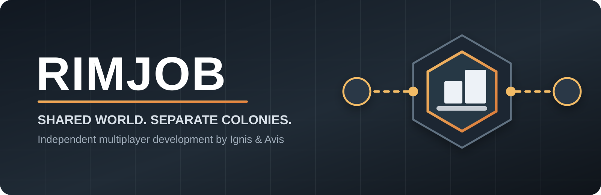

  

  <strong>An independent multiplayer project for RimWorld, developed by Ignis &amp; Avis.</strong>

  
  
  

# Rimjob

Rimjob is no longer being presented as a copy of **RimWorld Together**. It is an independent continuation with a different multiplayer direction, its own releases, its own branding and its own development priorities.

The core idea is simple: **play in the same RimWorld world without turning every player into one shared omniscient colony controller.**

## What Rimjob is building

Rimjob is focused on a more grounded multiplayer structure where players remain distinct while still being able to exist, cooperate and compete in the same world.

- **Separate player colonies and ownership** - your pawns are yours, another player's pawns are theirs.
- **Shared world tiles** - multiple player settlements can occupy the same wider multiplayer area rather than being forced apart by vanilla settlement rules.
- **Larger shared colony spaces** - current development targets expanded maps suitable for several independently controlled settlements.
- **Player-specific diplomacy** - players can be allies, neutral or hostile independently rather than inheriting one global relationship state.
- **Cooperation without shared control** - trade, support, defence and joint activity without giving another player direct control of your colony.
- **Dedicated hosting** - Rimjob includes a standalone server build for players who want to host persistent worlds.
- **Installer-first releases** - Windows releases are being packaged as both a conventional ZIP and an MSI installer, with the server offered as an optional host component.

## Current direction

The immediate multiplayer work is centred on **shared-tile settlement support**. A joining player should be able to choose an existing occupied multiplayer tile, create their own settlement there and retain their own pawn and faction ownership.

This is deliberately different from a single shared-colony model. Rimjob is aiming for **several players living in the same world and potentially the same local area, while remaining separate colonies**.

### Development priorities

1. Reliable shared-tile starting settlement creation.
2. Multiple independently persisted settlements on one tile.
3. Strict pawn ownership and remote-control boundaries.
4. Player-to-player diplomacy and relationship state.
5. Larger maps that make multi-colony settlement practical.
6. Better joining, reconnecting and world-state synchronisation.
7. Cleaner client/server installation and release packaging.

## Installation

Rimjob requires **Harmony**.

For packaged releases, the preferred Windows installation method is the Rimjob MSI. The client is installed into the selected RimWorld installation under `Mods/Rimjob`. The dedicated server is an optional component for the player hosting the world.

Manual ZIP builds contain the same client files plus the standalone server executable.

> [!IMPORTANT]
> Do not enable the original RimWorld Together Workshop mod at the same time as Rimjob. Rimjob still retains some inherited internal identifiers for compatibility while the project is being separated cleanly.

## Project identity

**Project:** Rimjob  
**Maintainers:** Ignis & Avis  
**Target:** RimWorld 1.6  
**Status:** Active development / experimental multiplayer

The repository name and some internal `RT`/`RWT` class names are historical implementation details. New user-facing work should use the **Rimjob** name.

## Origins & credits

Rimjob began from the open source **RimWorld Together** codebase and would not exist without the work of that project's maintainers and contributors.

Original project: [RimWorld Together](https://github.com/RimworldTogether/Rimworld-Together)

We retain attribution, commit history and the inherited licence where applicable. Credit to the original project does **not** mean Rimjob is an official RimWorld Together release, continuation or support channel. Rimjob is developed independently by **Ignis & Avis** and now has its own direction.

RimWorld is developed by Ludeon Studios. Rimjob is an unofficial community mod and is not affiliated with or endorsed by Ludeon Studios.

## Contributing

Issues, reproducible bug reports and focused pull requests are welcome. Please read the local [contribution guidelines](.github/CONTRIBUTING.md) before submitting changes.

When reporting multiplayer bugs, include both client and server logs where possible and state whether the issue affects the host, joining player or both.

## A note on the name

Yes, it's called **Rimjob**.

We're keeping it.