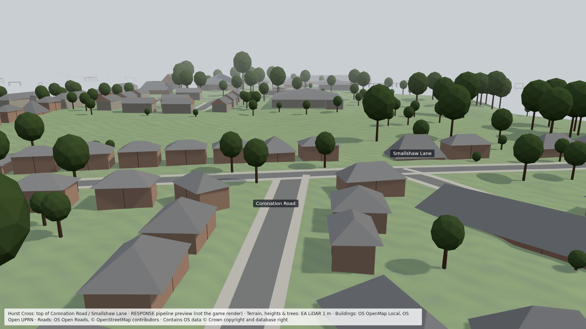
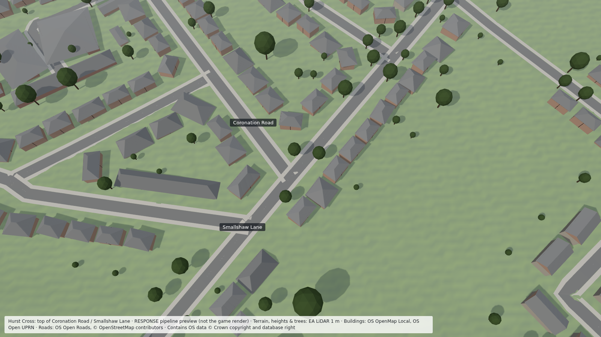

# 08 — First real-data run: Hurst Cross (Coronation Road / Smallshaw Lane)

Date: 2026-09-26. Zone: 800 × 800 m centred near the junction (E 394508, N 400516, about 146 m ODN).

*Pipeline preview (`cli preview`), not the Unreal render.*

## Data used (all free)
| Data | How it was fetched |
|---|---|
| EA LiDAR Composite DTM + first-return DSM, 1 m | EA WCS `GetCoverage` (GeoTIFF, EPSG:27700) |
| OS OpenMap Local buildings, **SJ and SD** | OS Downloads API (shapefile) |
| OS Open Roads RoadLink, SJ and SD | OS Downloads API (GB shapefile, SJ/SD files extracted) |
| OS Open UPRN (address points) | OS Downloads API (GB CSV, filtered to Tameside, 575k points) |
| OpenStreetMap | OSM API `map` call for the bbox |

## Results
- 686 buildings, 1,789 units (homes/premises), 152 road links, 135 nodes, 268 LiDAR-detected trees in the preview window.
- Building types: 467 semi-detached, 64 terrace, 38 flats (council_1960s), 83 detached, 29 other, 3 church, 2 civic.
- Roofs: 559 hip, 64 gable, 46 complex, 9 mono-pitch, 8 flat. Hipped 1930s-style semi pairs dominate here, and that matches the DSM hillshade.
- 99 buildings flagged for QA.
- Coronation Road: local road, 20 mph (from OSM), rising from about 138 m to 146 m at the Smallshaw Lane junction.

## Problems the run exposed, now fixed
1. **Tameside straddles two OS 100 km squares.** Everything north of northing 400000 is in SD, not SJ. `footprints` and
   `roads` now take several files, and they stop with a clear message if the zone gets no buildings.
2. **OS shapefiles are 3D (Z = 0).** Geometry is now flattened to 2D.
3. **OS OpenMap Local merges attached houses.** A semi pair or terrace row is one polygon, so the first run called
   598 buildings "detached". Fix: count **OS Open UPRN address points** and **OSM buildings** inside each polygon.
   Records now carry `units` (count, basis, per-unit outlines split along the long axis), and building types use the
   unit count. The preview draws party walls as seams.

## Known limits (next iterations)
- Roofs are placed on the footprint's ridge-aligned rectangle, so L-shaped houses get a simplified roof. The LAZ plane-fitting
  upgrade and a straight-skeleton roof in Houdini will fix this.
- Garden walls, hedges, fences, driveways, street furniture and lamp columns are not generated yet (Stage G).
- Wall colours are placeholders by building type until Stage D (facades) runs.
- Road junctions are plain overlaps. Proper junction geometry, dropped kerbs and markings come from the Houdini road HDA.
