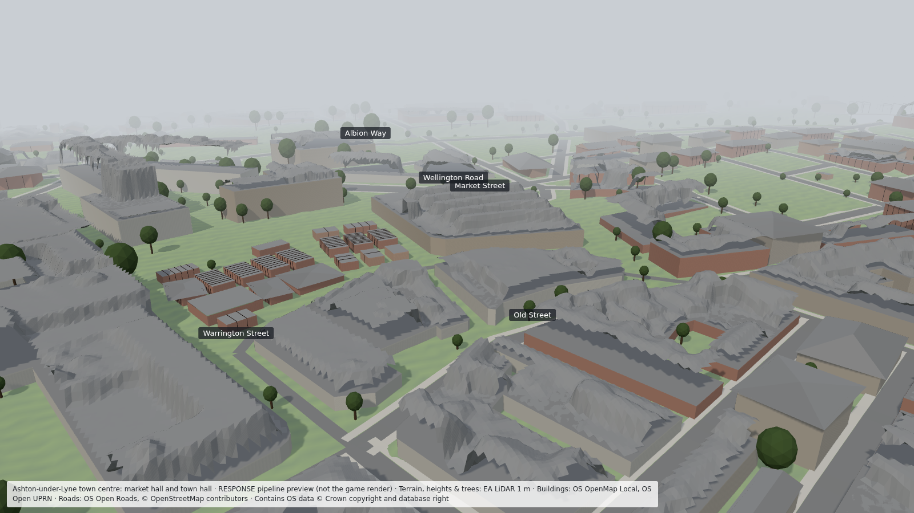

# 10 — Getting Ashton to "GTA V/VI" visual quality

Target: a street-level, photoreal 1:1 Ashton-under-Lyne, down to individual facades, door colours, shopfronts,
garden walls, bins and litter. This doc covers what gets us there and what is automated vs hand-made.

## Where we are (2026-09-26)

The full 2 × 2 km Ashton centre zone runs end to end from real data in about 30 s:
2,331 building outlines (15,498 units), 1,521 road links, 1 m terrain, heights, roof types and archetypes.
This is the **skeleton**: exact positions, sizes, heights, roof shapes and building types. Everything visual sits on top of it.

## The layers still to build

| Layer | How | Automated? | Needs |
|---|---|---|---|
| **Ground cover** (Stage G) | OSM/OS polygons: pavements, market square paving, car parks, gardens, yards, alleys (ginnels), verges. INSPIRE plots for garden boundaries. PCG for boundary walls, hedges, fences, gates, drives | ~85% | Nothing, can start now |
| **Facade data** (Stage D) | Street-level images → segmentation → per-building: storeys, bay layout, window type (sash / uPVC / bay), door type and colour, brick/render/pebbledash colour, shopfront extent, signage area | ~70% | **Imagery**: Mapillary (free API token) + your 360° drives for gaps |
| **Building kit** (art) | Modular Nanite pieces per archetype: Victorian terrace (sash, stone lintels, chimney stacks), 1930s hipped semi (bay, porch, pebbledash), 1960s council, mill, shop terrace, modern retail. Trim sheets and tileable materials | 0%, this is art | Artist time or asset budget (see below) |
| **Assembly** (Stage E) | Houdini reads the skeleton + facade record and places kit pieces per building. Per-house variation: doors, extensions, dishes, bins, curtains, lights at night | ~90% once the kit exists | Houdini Apprentice (approved) |
| **Materials** | Photo-sourced: your photos → Substance/Materialize, or scanned materials. Wet-rain variants (Manchester!) | partly | Asset source decision |
| **Hero landmarks** | Photogrammetry reference → hand-cleaned meshes: market hall, town hall, St Michael's, Ladysmith, police station, Portland Basin | 0% | Capture photos, modelling time |
| **Dressing** (Stage G) | PCG: lamp columns, UK signage, road markings (TSRGD), bollards, bus stops, bins, cables, litter by deprivation | ~85% | Kit props |
| **Lighting/weather** | Lumen, sun from `ResponseTime` (real Ashton sun), rain, wet roads, sodium/LED street lights | engine | UE on your PC |

**Honest point:** the pipeline makes Ashton *accurate* and *varied*. What makes it look like GTA is the quality of the
kit, materials and hero assets, which is art. A 2 × 2 km centre at that bar is roughly 15 archetype kits
(~80–120 pieces each), ~60 materials and ~8 hero buildings. Solo, that is many months of skilled 3D work. With bought
asset packs as a base, it is weeks of adaptation plus the hero buildings.

## Status of the asks (2026-09-26)
- Mapillary token: **received** (stored outside git). Coverage and matching: `docs/11_streetview.md`.
- 360° capture: **declined**, so facades not seen in photos are inferred from their neighbours.
- Unreal: session with the creative director planned for 2026-09-27.
- Art: marketplace packs allowed, free where possible. GTA mod packs assessed and not used (S-15). CC0 and OGL replacements (S-16).

## What I needed from you (original asks)
1. **Mapillary API token** (free: mapillary.com → Dashboard → Developers → register app → client token). I can then check
   Ashton coverage and start Stage D on real images.
2. **360° capture:** will you drive or walk Ashton centre with a 360 camera? (S-08.) It gives the best facades and material photos.
3. **Unreal on your PC:** which UE5 version, and can you build the project? Everything C++ is still uncompiled.
4. **Art sourcing:** hand-made only, or allow Fab marketplace packs / Megascans (per-asset licences; many free or cheap for
   non-commercial)? This decides how fast we reach the visual bar.
